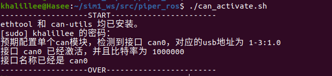
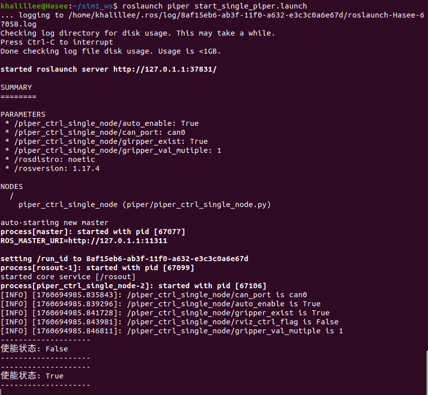
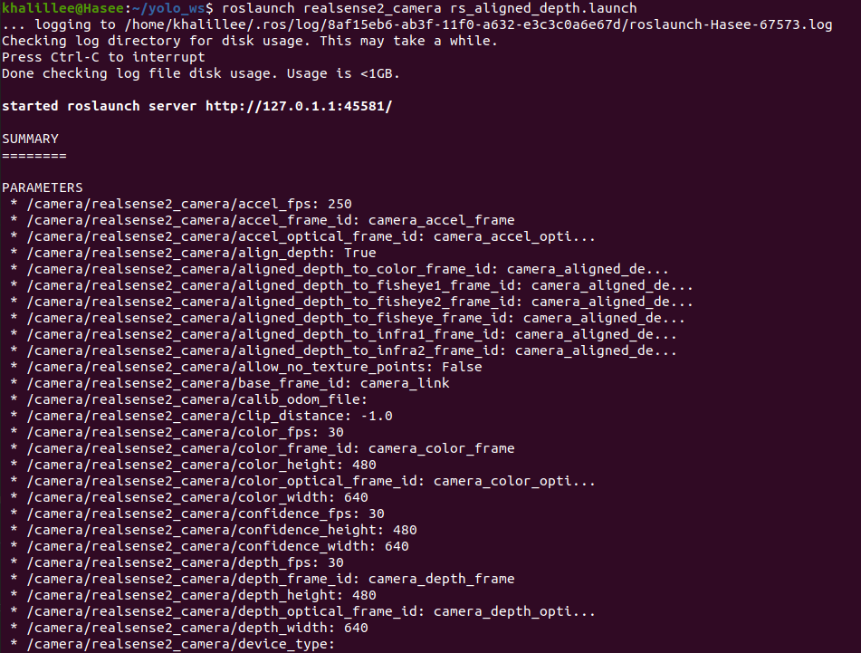
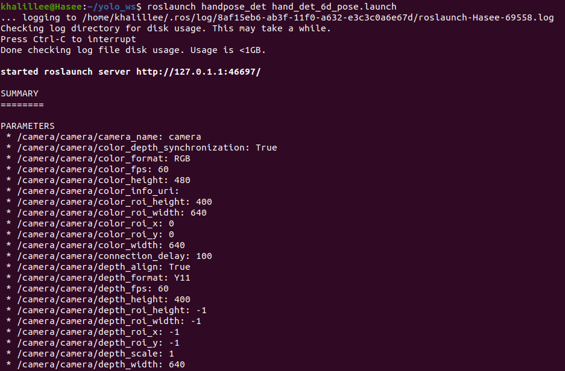
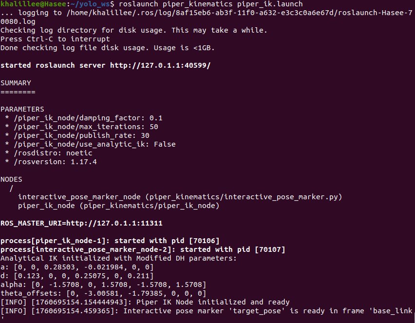
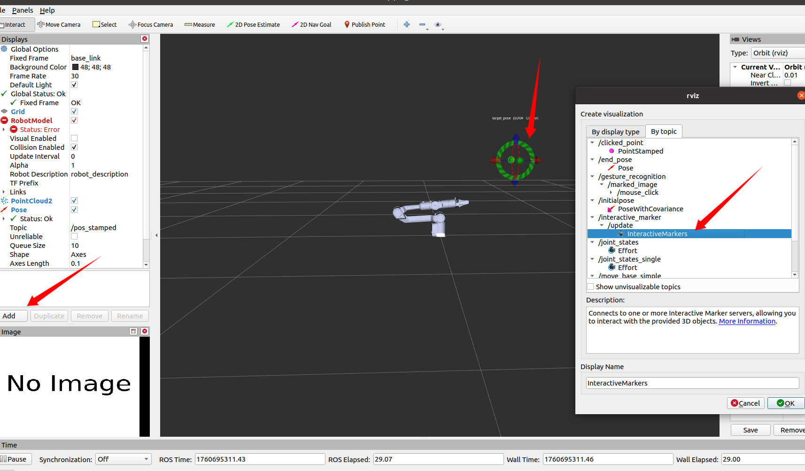
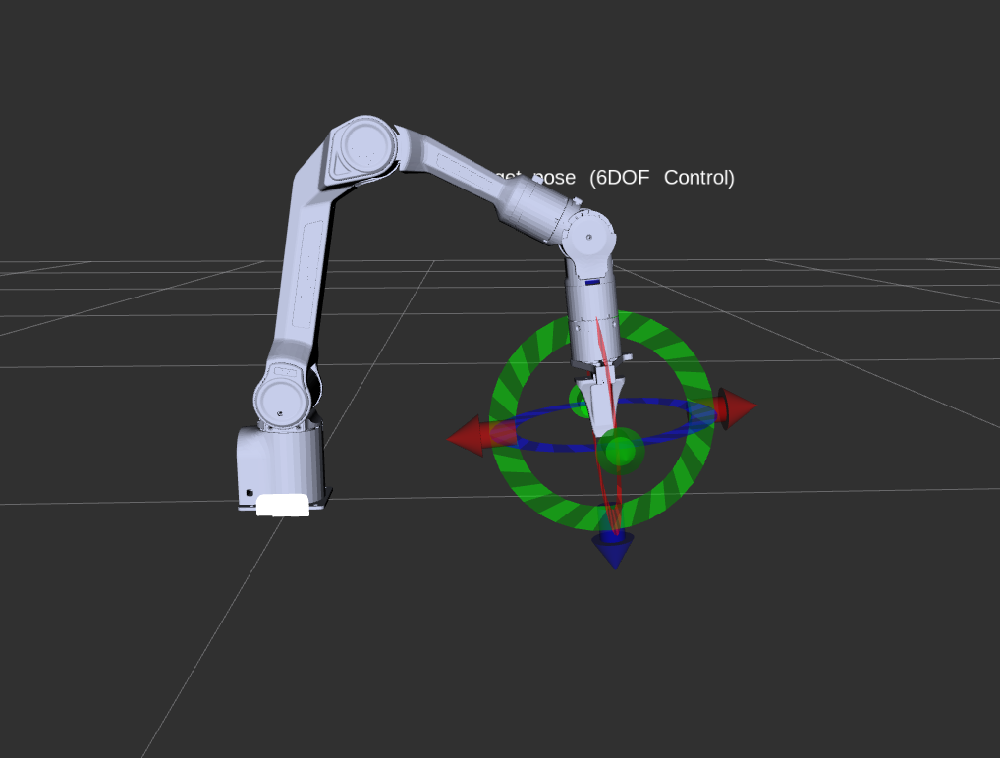
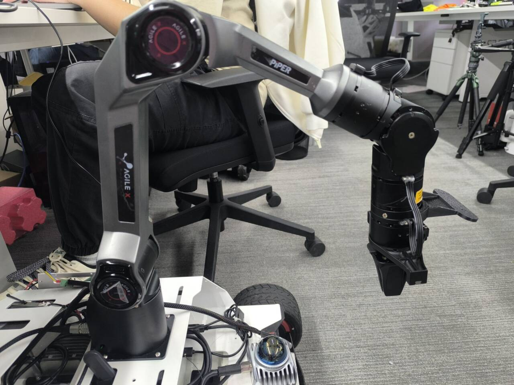
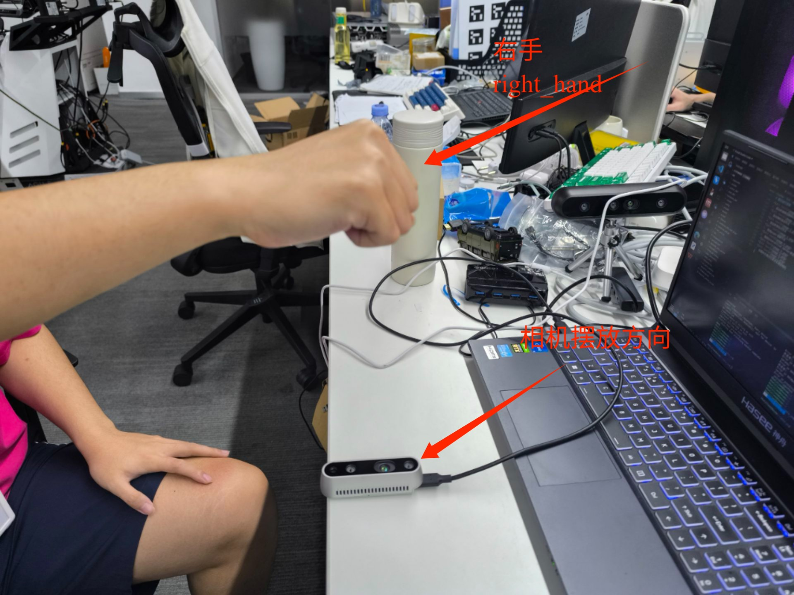
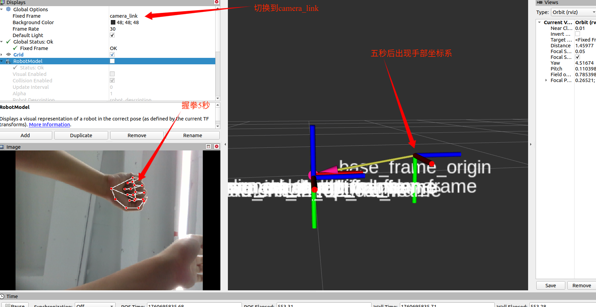

# TeleGestic-直观的机器人遥操作，只需手势即可

## 仓库

- TeleGestic:[https://github.com/vanstrong12138/TeleGestic](https://github.com/vanstrong12138/TeleGestic)
- Agilex-College:[https://github.com/agilexrobotics/Agilex-College/tree/master](https://github.com/agilexrobotics/Agilex-College/tree/master)

## 硬件设备

- 奥比中光 Petrel（带对齐的深度图像与RGB图像：640*400@30fps）
- （可选）：intel realsense D435（带对齐的深度图像与RGB图像：640*480@30fps）
- （可选）：奥比中光 gemini （带对齐的深度图像与RGB图像：640*400@60fps）
- （可选）：奥比中光 dabai_dc1 （带对齐的深度图像与RGB图像：640*400@30fps）
- AgileX robotics PiPer机械臂

## 软件环境

- Ubuntu 20.04
- ROS noetic

## 依赖

- 安装依赖的ROS功能包

````bash
sudo apt install -y ros-noetic-sensor-msgs ros-noetic-image-transport ros-noetic-cv-bridge ros-noetic-vision-msgs ros-noetic-image-geometry ros-noetic-pcl-conversions ros-noetic-pcl-ros ros-noetic-message-filters
````

- PIPER机械臂驱动部署请参考：https://github.com/agilexrobotics/piper_sdk/blob/1_0_0_beta/README(ZH).MD

- PIPER机械臂ROS控制节点部署参考：https://github.com/agilexrobotics/piper_ros/blob/noetic/README.MD

- 克隆并编译此功能包

````bash
cd your_ws/src
git cloen https://github.com/vanstrong12138/TeleGestic.git
catkin_make
source devel/setup.bash
````

## 启动相机ROS节点

- 需要相机能自动对齐深度图像与彩色图像（D2C），此项目暂时不支持没有自动对齐功能的相机，对齐后的深度图像与RGB图像长宽一致。此项目使用[奥比中光 Genimi](https://orbbec.com.cn/index/Product/info.html?cate=38&id=28)深度相机作为功能测试，具体配置运行示例以及设置请参考[奥比中光相机驱动仓库](https://github.com/orbbec/ros_astra_camera.git)

- 奥比中光 Genimi使用下面的命令启动，需要先在*gemini.launch*文件中配置深度对齐功能

````bash
source devel/setup.bash
roslaunch roslaunch astra_camera gemini.launch 
````

- realsense D435使用下面的命令启动

````bash
roslaunch realsense2_camera rs_aligned_depth.launch
````

## 启动机械臂驱动节点

- 将连接到机械臂的can模块插入PC，查找机械臂CAN总线,并启动机械臂驱动节点

````bash
# 寻找机械臂的CAN端口
./find_all_can_port.sh
# 连接到机械臂的CAN端口
./can_activate.sh

roslaunch piper start_single_piper_ik_rviz.launch
````

- 使用*piper_kinematics*中的交互式标记*interactive_pose_marker*工具，通过拖拽机械臂到达期望的home点

- 见[piper_kinematics](https:https://github.com/vanstrong12138/Piper_kinematics)中的*interactive_pose_marker*工具

- 启动*piper_kinematics*中的逆解节点，下达对Piper的控制指令到控制节点

````bash
rosrun piper_kinematics piper_ik_node 
rosrun piper_kinematics interactive_pose_marker.py
````

- 或者使用launch文件启动
```bash
roslaunch piper_kinematics piper_ik.launch
```

# 完整运行流程

```bash
cd your_ws
source devel/setup.sh

# 1.激活CAN通信
cd piper_ros
./can_activate.sh

# 2.启动机械臂控制ROS节点
roslaunch piper start_single_piper_ik_rviz.launch

# 3.启动相机驱动节点 或者 使用奥比中光深度相机
roslaunch realsense2_camera rs_aligned_depth.launch
# or
roslaunch astra_camera gemini.launch 

# 4.启动手势检测节点
# 注意修改 scripts/handpose_det_new_ik.py 中的话题名称以适配你使用的相机
roslaunch handpose_det hand_det_6d_pose.launch 

# 5.启动piper逆解节点
roslaunch piper_kinematics piper_ik.launch

# 6.拖动interactive_marker来定义机械臂末端初始点

# 7.如图所示相对位置关系摆放相机

# 8.右手握拳5秒以确定手部坐标系

# 9.张开手并拢四指以控制机械臂六个自由度、拇指控制夹爪开合
```

# 图示运行流程

1. 启动CAN通信

2. 启动机械臂控制ROS节点

3. 启动相机驱动节点

4. 启动手势检测节点

5. 启动piper逆解节点

6. 拖动interactive_marker来定义机械臂末端初始点



7. 如图所示相对位置关系摆放相机

8. 右手握拳5秒以确定手部坐标系

9. 张开手并拢四指以控制机械臂六个自由度、拇指控制夹爪开合